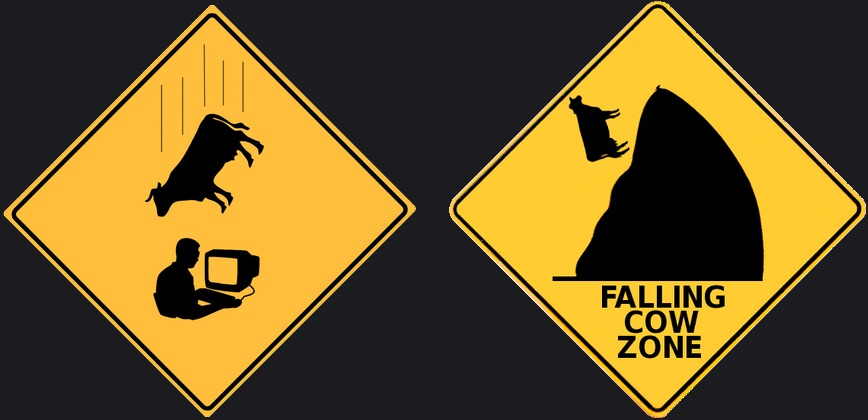

# ╔══════════════════════════════════════════════════════════════════════════════╗
# ║                                                                              ║
# ║   ███████╗ █████╗ ██╗     ██╗     ██╗███╗   ██╗ ██████╗                      ║
# ║   ██╔════╝██╔══██╗██║     ██║     ██║████╗  ██║██╔════╝                      ║
# ║   █████╗  ███████║██║     ██║     ██║██╔██╗ ██║██║  ███╗                     ║
# ║   ██╔══╝  ██╔══██║██║     ██║     ██║██║╚██╗██║██║   ██║                     ║
# ║   ██║     ██║  ██║███████╗███████╗██║██║ ╚████║╚██████╔╝                     ║
# ║   ╚═╝     ╚═╝  ╚═╝╚══════╝╚══════╝╚═╝╚═╝  ╚═══╝ ╚═════╝                      ║
# ║                                                                              ║
# ║              ██████╗ ██████╗ ██╗    ██╗    ███████╗ ██████╗ ███╗   ██╗███████╗║
# ║             ██╔════╝██╔═══██╗██║    ██║    ╚══███╔╝██╔═══██╗████╗  ██║██╔════╝║
# ║             ██║     ██║   ██║██║ █╗ ██║      ███╔╝ ██║   ██║██╔██╗ ██║█████╗  ║
# ║             ██║     ██║   ██║██║███╗██║     ███╔╝  ██║   ██║██║╚██╗██║██╔══╝  ║
# ║             ╚██████╗╚██████╔╝╚███╔███╔╝    ███████╗╚██████╔╝██║ ╚████║███████╗║
# ║              ╚═════╝ ╚═════╝  ╚══╝╚══╝     ╚══════╝ ╚═════╝ ╚═╝  ╚═══╝╚══════╝║
# ║                                                                              ║
# ╚══════════════════════════════════════════════════════════════════════════════╝

---

# 🚨 YOU HAVE ENTERED A FALLING COW ZONE 🚨

<!-- Same-size diamonds, white exterior removed, dark plate (GitHub page is white so raw transparency still looked white) -->
<p align="center">
  
</p>

```text
╔═══════════════════════════════════════════════════════════════════════════════╗
║                                                                               ║
║   ████  STOP. READ THIS BEFORE YOU CLONE, WIRE, OR COOK ANYTHING.  ████       ║
║                                                                               ║
║   THIS PROJECT IS UNDER CONSTRUCTION.                                         ║
║   IT HAS NOT BEEN TESTED ON REAL HARDWARE / REAL FOOD YET.                    ║
║                                                                               ║
║   YOU ARE ENTERING A FALLING COW ZONE.                                        ║
║   Expect missing pieces, wrong assumptions, broken diagrams, and              ║
║   designs that may change without mercy.                                      ║
║                                                                               ║
║   DO NOT treat this repository as production guidance.                        ║
║   DO NOT trust temperatures, wiring, or firmware notes as validated.          ║
║   DO NOT connect mains heaters from these notes without your own review.      ║
║                                                                               ║
║   MAINS ELECTRICITY + HEATERS CAN KILL.                                       ║
║   FOOD SAFETY FOR MEAT IS YOUR RESPONSIBILITY.                                ║
║                                                                               ║
║   If something here works someday, that will be a pleasant surprise —         ║
║   not a promise.                                                              ║
║                                                                               ║
║   Status:  🚧 UNDER CONSTRUCTION  ·  🧪 UNTESTED  ·  🐄 FALLING COW ZONE     ║
║                                                                               ║
╚═══════════════════════════════════════════════════════════════════════════════╝
```

> ### ⚠️ Huge disclaimer (again, on purpose)
>
> **Falling Cow Zone** means: experimental notes only. Not field-tested. Not certified. Not a finished product. Use at your own risk. If a cow falls on your project schedule, that is expected weather in this zone.

---

# DIY ESP32 Food Dehydrator (design notes)

Knowledge graph / design package for a **mostly automated** DIY food dehydrator:

- ESP32 Soft-AP web UI (local, no cloud required)
- Climate control (temp + humidity + airflow)
- **Meat mode** — minimum chamber temperature floor so meat is not left cold to spoil
- **Finishing mode** — rest → internal fan only → humidity bounce decides continue dry vs ready
- Warnings, recommendations, profiles, safety interlocks (design stage)

### What this repo is today

| Item | Reality |
|------|---------|
| Format | Logseq Markdown graph (`pages/`, `journals/`, `assets/`) |
| Firmware | **Not implemented / not tested** |
| Hardware build | **Not validated** |
| Food safety claims | **Design targets only — validate yourself** |

### Start reading (after accepting the cow)

1. [`pages/00 Overview.md`](pages/00%20Overview.md)
2. [`pages/contents.md`](pages/contents.md)
3. [`pages/Meat Mode.md`](pages/Meat%20Mode.md)
4. [`pages/Finishing Mode.md`](pages/Finishing%20Mode.md)
5. [`pages/UI Info Page.md`](pages/UI%20Info%20Page.md)
6. [`pages/Build Checklist.md`](pages/Build%20Checklist.md)

### Open in Logseq

Add graph folder → select this repository root (folder that contains `pages/` and `logseq/`).

---

## License / liability

No warranty of any kind. Experimental. Falling cow zone. You break it, you own both pieces (and the cow).

```text
     (__)
     (oo)   moo = untested
      \/ \
      ||----w |
      ||     ||
   ~~~ falling cow weather advisory ~~~
```
