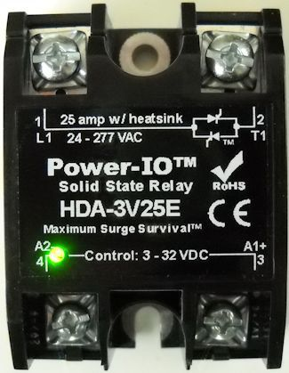
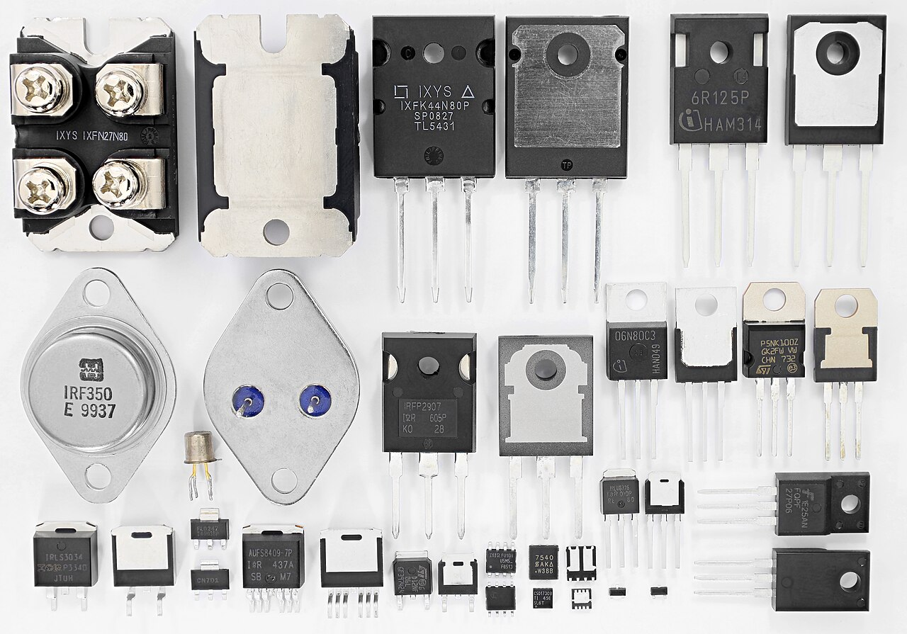
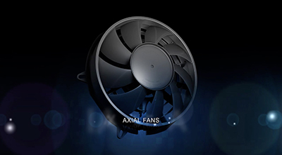

- type:: hardware
- created:: 2026-07-18
- tags:: #actuators
-
- ## Heater (SSR)
-
- ### Reference photos
- {:height 240}
- {:height 240}
- {:height 240}
- {:height 220}
- Credits: [[Image Credits]]
- Zero-cross SSR preferred for resistive heaters.
- Firmware duty 0–100% over a 1–2 s time base (time-proportioning) if using on/off SSR.
- Never exceed `max_duty` from profile/safety.
-
- ## Fan (PWM)
- Quiet low speed for gentle herbs; high for jerky / high moisture start.
- Minimum duty to guarantee airflow when heater > 0 (unless fault).
- Prefer modeling **internal (circulation)** vs optional **exhaust** channels even if hardware is one fan at v1 (map exhaust=off as “internal only” duty profile).
-
- ## Finishing mode duties
- REST: heater off (or meat warm-rest hold); fans off/trickle.
- PROBE: heater off; **internal fan only** on; exhaust off — RH bounce test ([[Finishing Mode]]).
-
- ## Meat mode
- When below floor: prioritize heat over high fan; never leave heater disabled while claiming meat-safe dry ([[Meat Mode]]).
-
- ## Buzzer / LED
- Patterns: warn chirp, critical continuous beep (cancellable), done melody once.
- Extra: short double-beep on `FINISH_RH_BOUNCE` (continue dry); done melody only after true READY→DONE.
-
- ## Actuator interlocks
- Heater requires: sensors valid AND door closed AND not FAULT AND state allows heat.
- FINISH_PROBE never allows heater.
- Fan may run in FAULT for cool-down except smoke/fire policy (default: fan on to dump heat unless door open policy says otherwise).
-
- ## Related
- [[Safety Interlocks]] · [[Control State Machine]] · [[Finishing Mode]] · [[Meat Mode]]
