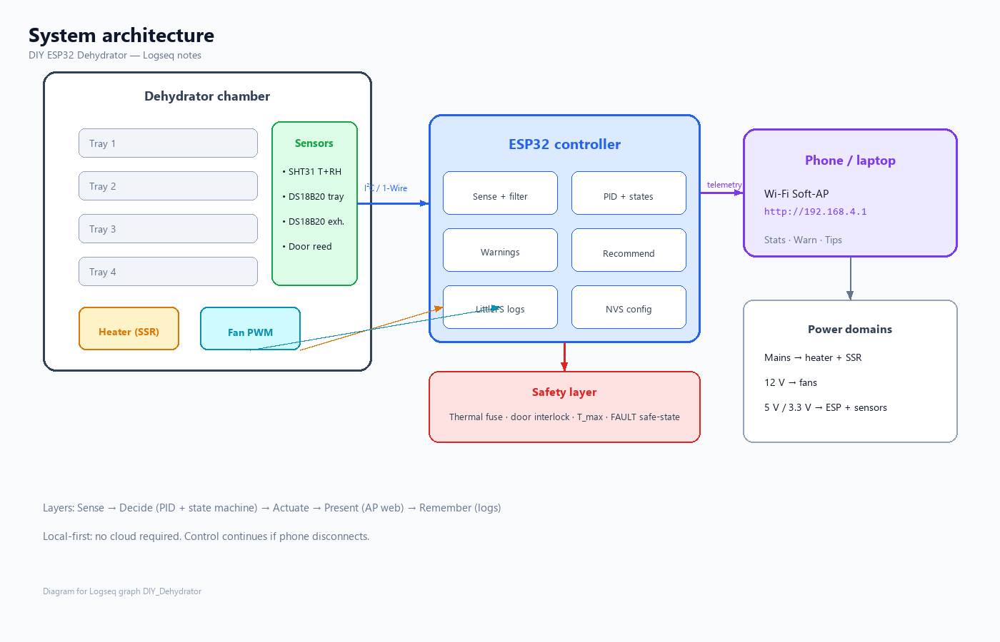
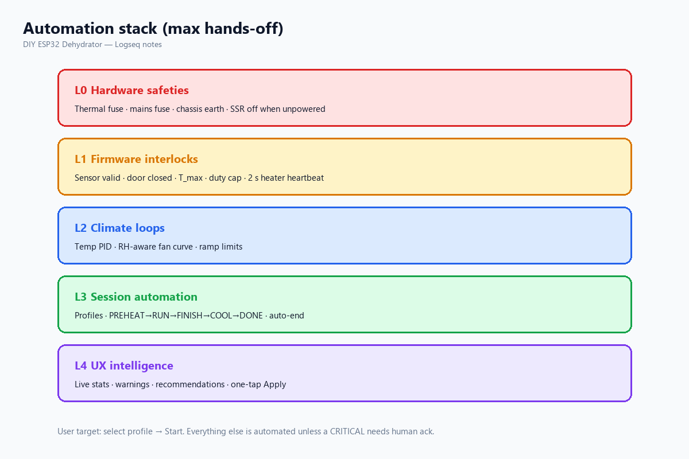
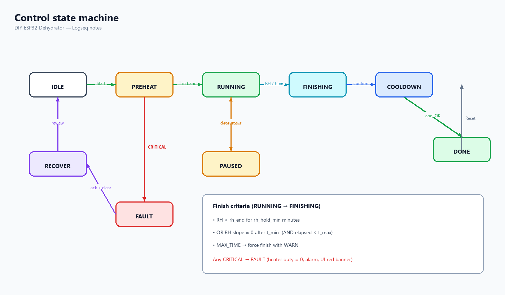
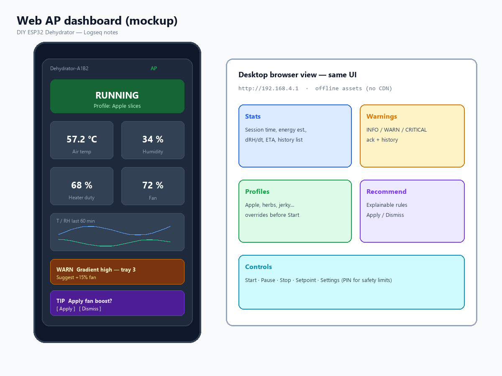
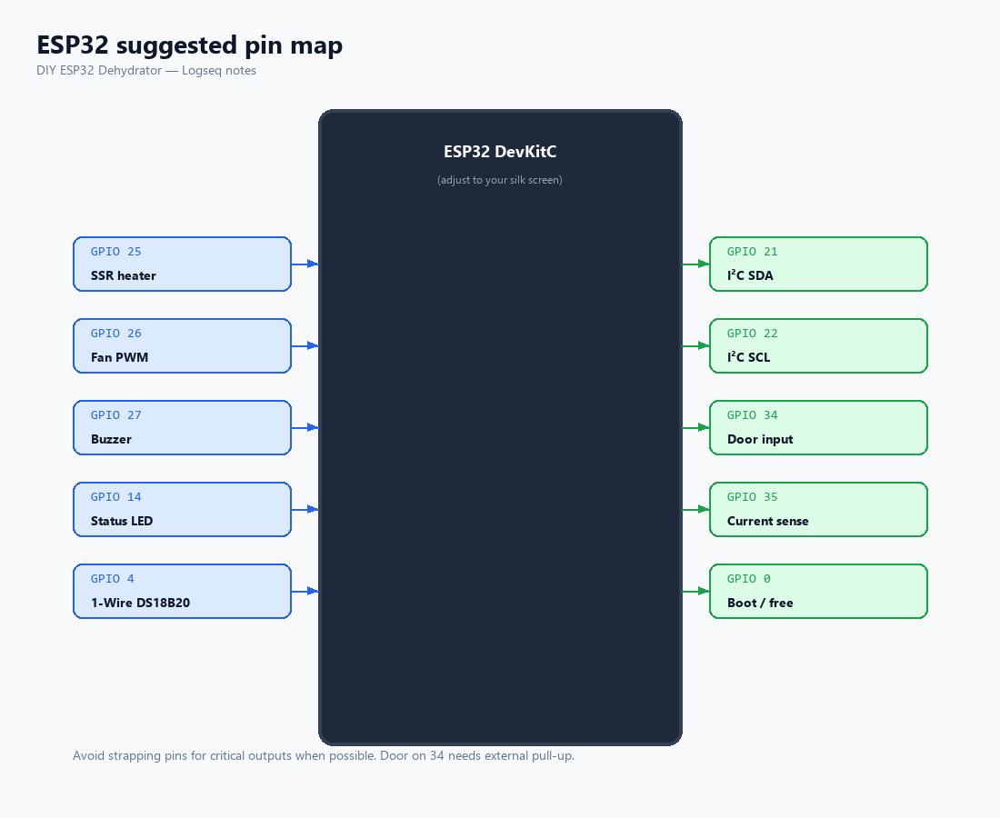
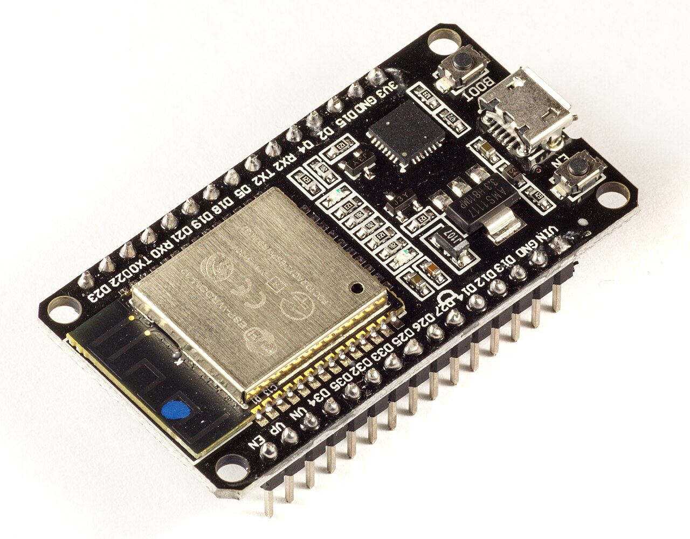
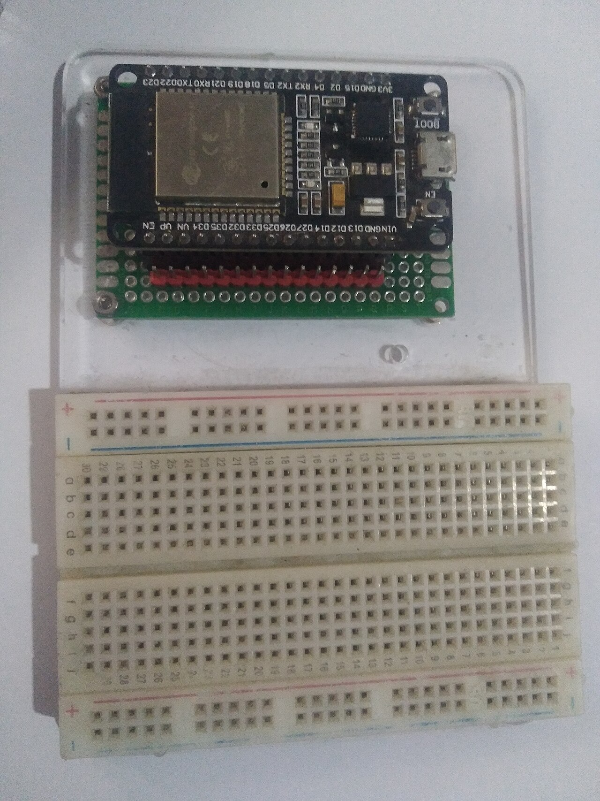
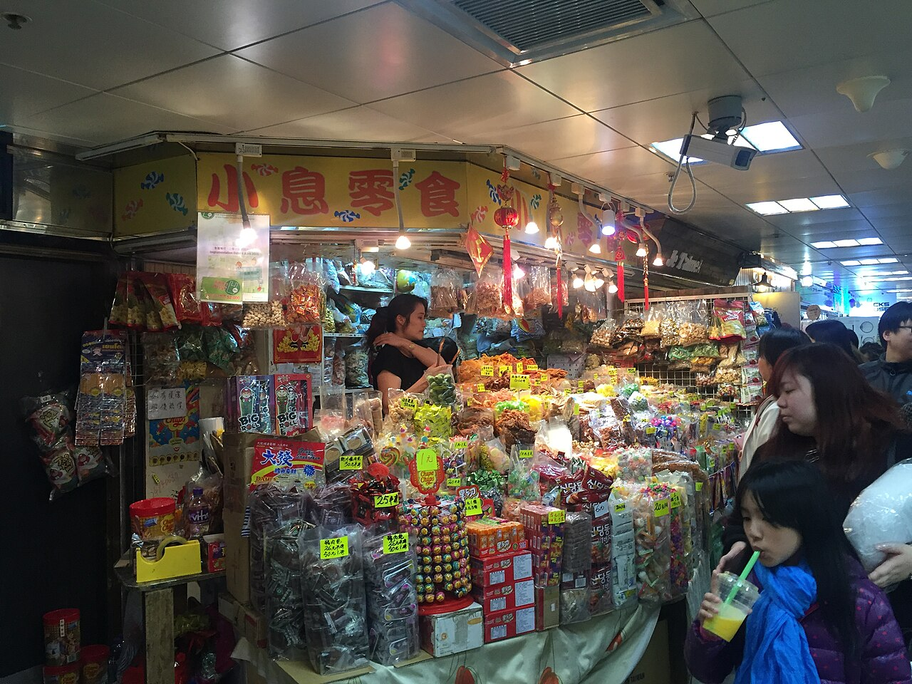
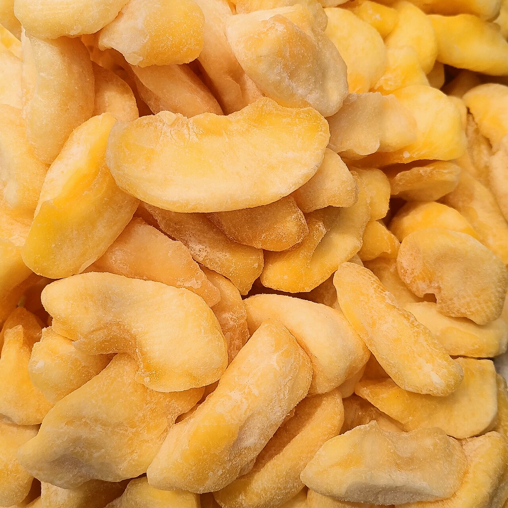
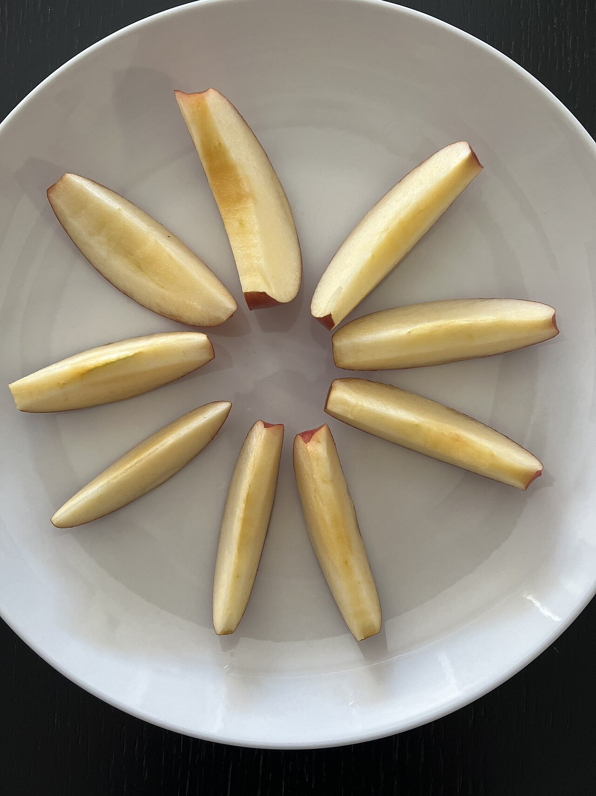

- type:: index
- created:: 2026-07-18
- tags:: #diagrams #assets #images
-
- ## Diagrams in this graph
- Technical figures generated for the DIY ESP32 dehydrator notes (PNG in `assets/`).
-
- ## Gallery
- ### System architecture
- 
- Page: [[01 Architecture]] · [[00 Overview]]
-
- ### Automation stack
- 
- Page: [[Automation Goals]]
-
- ### Chamber airflow
- 
- Page: [[Mechanical Enclosure]]
-
- ### Electrical overview
- 
- Page: [[Electrical Wiring]]
-
- ### Control state machine
- 
- Page: [[Control State Machine]]
-
- ### Web AP UI mockup
- 
- Page: [[Web AP Interface]]
-
- ### ESP32 pin map
- 
- Page: [[Pin Map ESP32]]
-
- ## How images work in Logseq
- Files live in `D:\Projects\DIY_Dehydrator\assets\`
- Markdown: ``
- Re-generate diagrams: run `python assets\_gen_diagrams.py` from the graph folder (or full path).
-
- ## When to add more images
- Photos of your real build (wiring, tray layout) — drop into `assets/` and embed the same way.
- Screenshots of the live web UI once firmware exists.
- Optional: hand sketches of custom enclosure dimensions.
-
- ## Internet source photos (Wikimedia Commons)
- Offline copies in `assets/web/` — full attribution on [[Image Credits]].
-
- ### Hardware
- {:height 220}
- {:height 220}
- {:height 200}
- {:height 200}
- {:height 200}
- {:height 200}
- {:height 200}
- {:height 200}
- {:height 200}
-
- ### Food / mechanical
- {:height 240}
- {:height 220}
- {:height 220}
- {:height 220}
