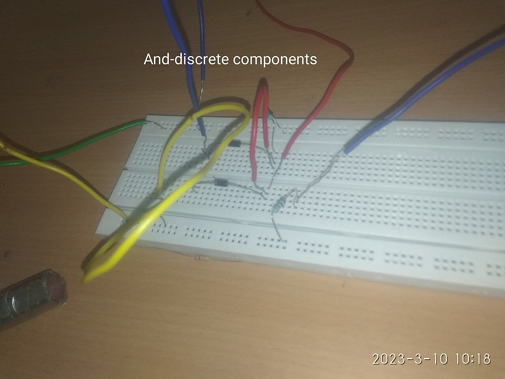
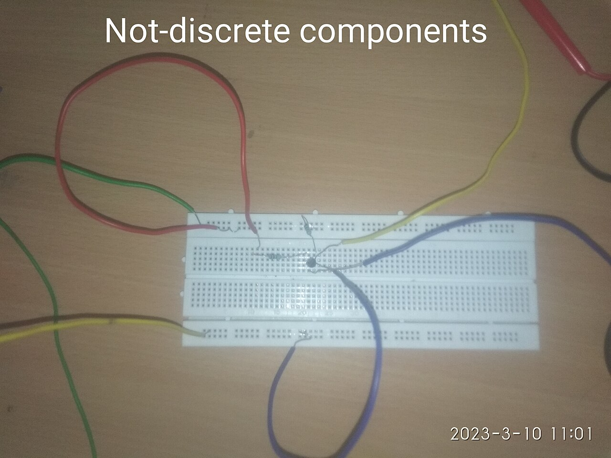
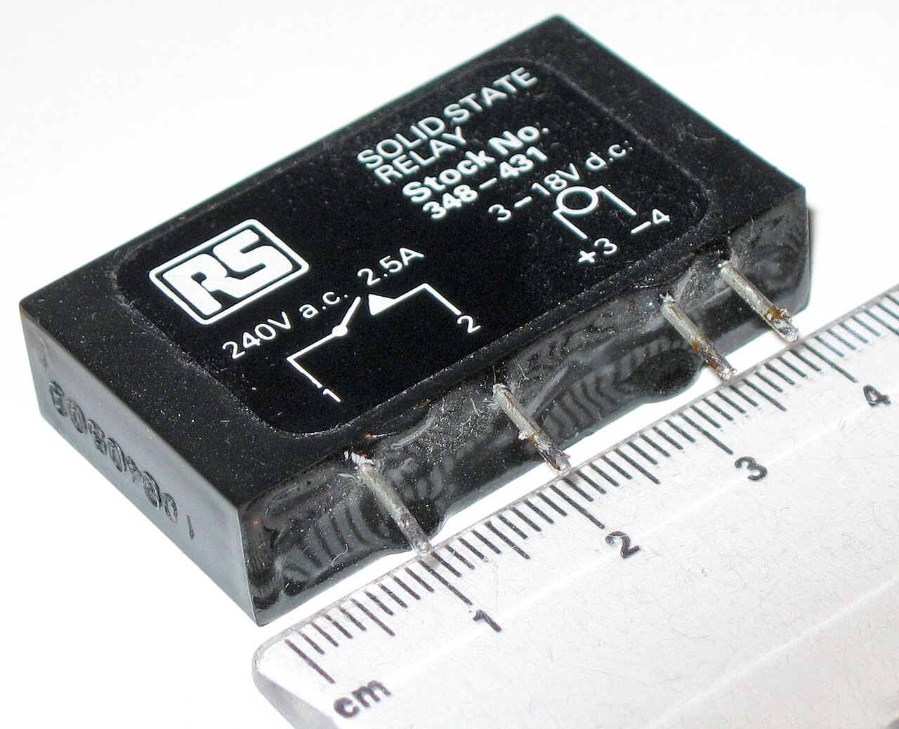
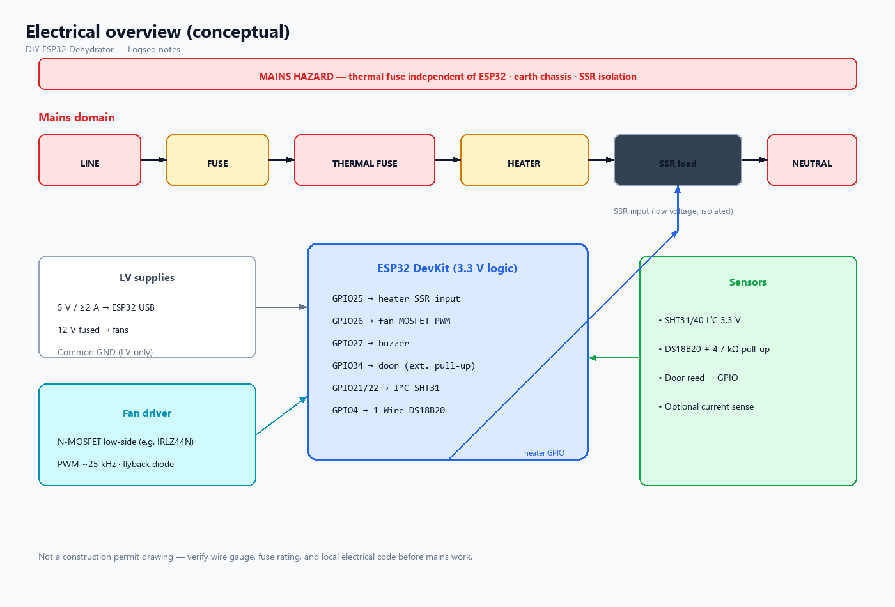

- type:: wiring
- created:: 2026-07-18
- tags:: #electrical #safety #wiring
-
- ## DANGER
-
- ### Reference photos
- {:height 260}
- {:height 240}
- {:height 240}
- Credits: [[Image Credits]]
-
- 
- Mains voltage. If unsure, use a certified appliance chassis and only switch the **low-voltage control side** of an SSR with proper isolation. Prefer electrician review for permanent installs.
-
- ## Mains heater circuit (conceptual)
- ```
- LINE -- FUSE -- THERMAL_FUSE -- HEATER -- SSR(load) -- NEUTRAL
-                              \-- optional mechanical overtemp thermostat series --
- SSR input+  <-- ESP32 GPIO (via driver if needed) 
- SSR input-  <-- GND (observe SSR datasheet isolation)
- ```
- Thermal fuse: **series**, not MCU-controlled.
- Fuse: sized to heater FLA with margin; slow-blow vs fast per element type.
-
- ## Low-voltage
- ESP32 5 V from quality USB PSU (not from random heater-adjacent transformer if noisy).
- 12 V fans: MOSFET low-side switch + PWM; common GND with ESP32.
- I²C SHT: 3.3 V, SDA/SCL, shared GND.
- 1-Wire DS18B20: 3.3 V or 5 V per module, data pin + 4.7 k pull-up to 3.3 V.
- Door switch: GPIO input INPUT_PULLUP to GND when closed (define polarity in firmware).
-
- ## Grounding / isolation
- Keep mains earth connected to metal chassis.
- Never share random mains neutral with logic GND.
- SSR provides optical isolation — do not defeat it.
-
- ## Noise hardening
- Twisted pairs for sensors; separate path from heater wires.
- 100 nF + 10 µF near ESP32 power.
- Software debounce door; median filter temps.
-
- ## Related
- [[Pin Map ESP32]] · [[Power System]] · [[Safety Interlocks]] · [[Actuators]]
