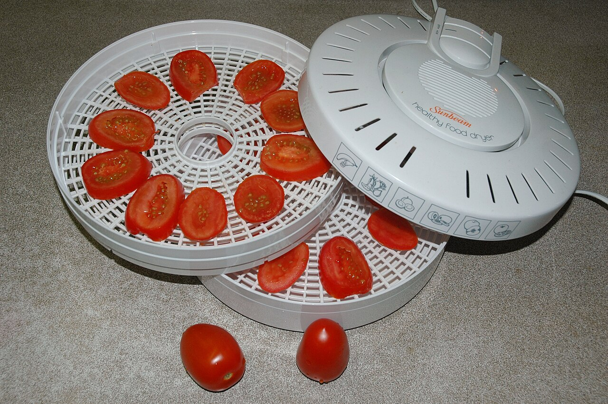
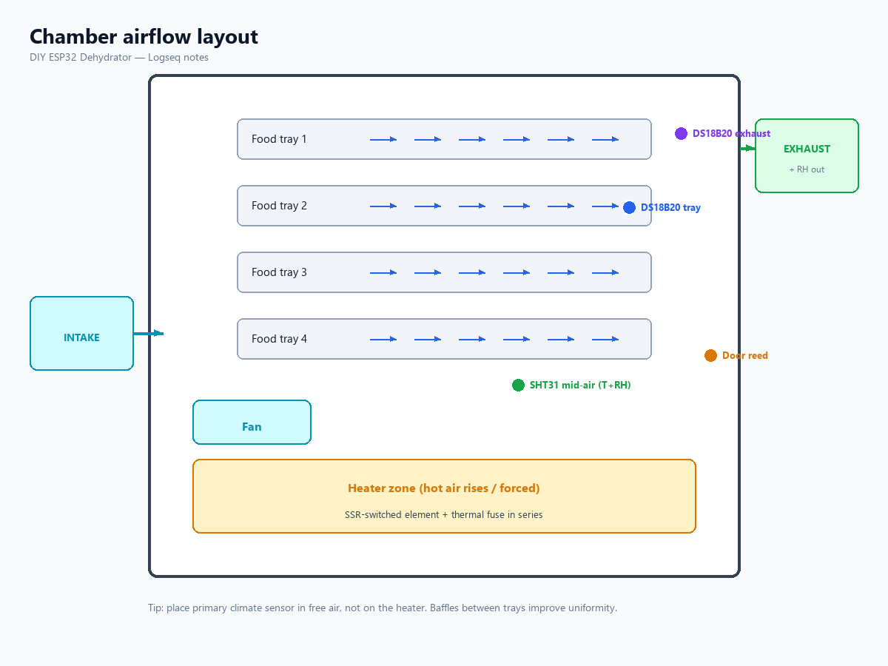

- type:: build
- created:: 2026-07-18
- tags:: #mechanical #enclosure
-
- ## Goals
-
- ### Reference photo (commercial form factor)
- {:height 340}
- Path A: repurpose a similar stackable unit and replace the dumb thermostat with ESP32 + SSR.
- Credits: [[Image Credits]]
-
- 
- Even airflow across trays, minimal dead zones.
- Food-safe contact surfaces (stainless / BPA-free trays).
- Heat retention without melting plastics near heater.
- Easy clean; door seals reasonably (not vacuum-tight).
-
- ## Two viable paths
- **A. Repurpose commercial dehydrator** — keep trays/heater, replace dumb thermostat with ESP32 + SSR. Fastest automation path.
- **B. Custom box** — insulated walls, bottom/rear heater, vertical or horizontal flow.
-
- ## Airflow layout (recommended)
- Intake → filter mesh → heater zone → rising/forced flow through trays → exhaust near top.
- Fan **after** heater (push hot air) or exhaust fan (pull) — pick one primary to avoid fighting flows.
- Baffles between trays improve uniformity.
-
- ## Sensor placement
- Primary climate (SHT): mid-chamber free air, not touching heater, shaded from radiant heat.
- DS18B20 tray: on middle tray rail.
- DS18B20 exhaust: near outlet for “done drying” gradient.
- Door reed: frame + magnet on door.
-
- ## Electronics placement
- ESP32 + PSUs **outside** hot chamber or in a cool bay with ventilation.
- SSR on heatsink, airflow across SSR if > few hundred watts continuous.
-
- ## Build notes
- Avoid styrofoam near heater.
- Use food-safe sealants only where food contact possible.
- Provide drip / crumb tray for sticky foods.
-
- ## Related
- [[Electrical Wiring]] · [[Sensors]] · [[BOM Parts List]]
