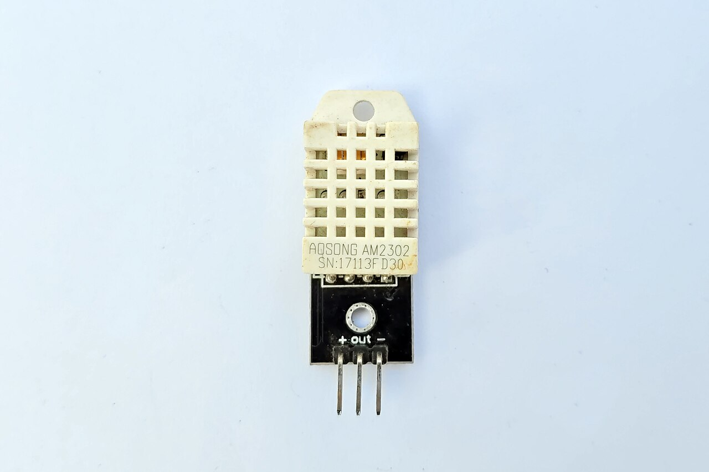
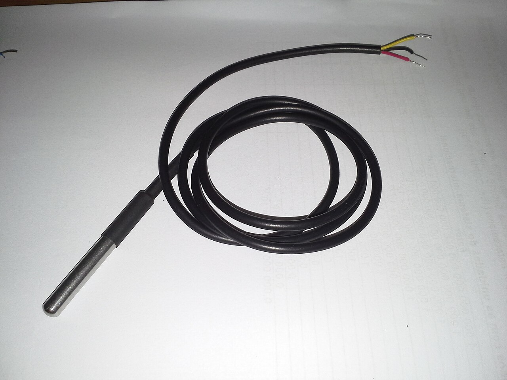
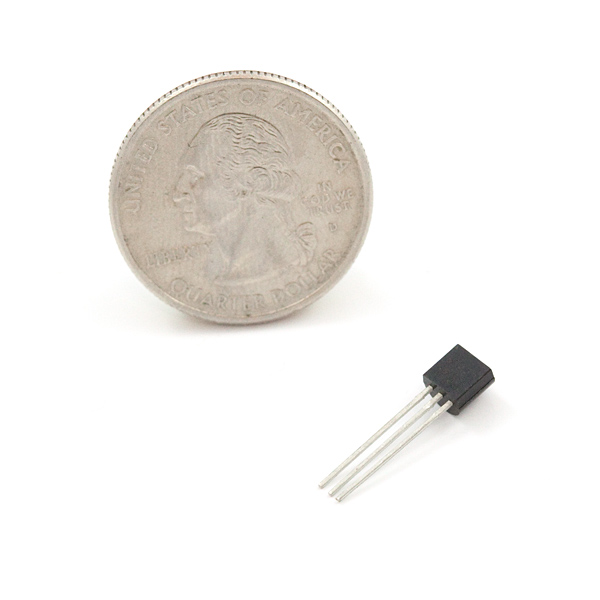
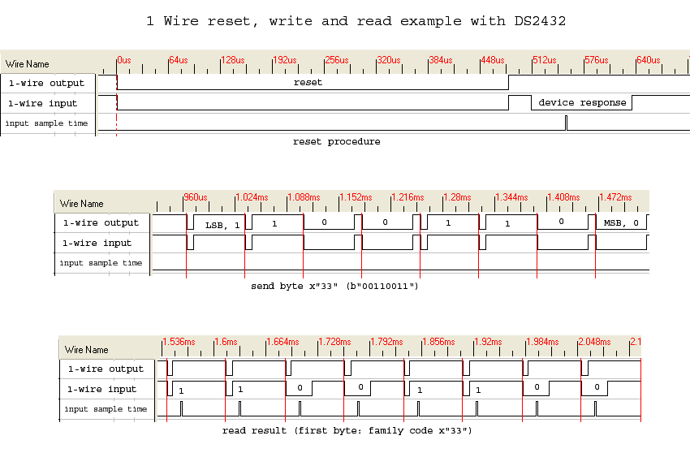

- type:: hardware
- created:: 2026-07-18
- tags:: #sensors
-
- ## Primary climate — SHT31/SHT40
-
- ### Reference photos
- {:height 260}
- {:height 260}
- {:height 220}
- {:height 200}
- Credits: [[Image Credits]]
- Measures Tair + RH for control, meat floor, and [[Finishing Mode]] probe (`drh` / slope).
- I²C; read 1 Hz enough; filter 5-sample median (use less smoothing on probe window so bounce is visible).
- Validity: RH 0–100, T −10–85 °C plausible for chamber.
-
- ## Tray / exhaust — DS18B20
- Detect stratification; warning if |Ttray − Tair| large for long.
- Parasite power discouraged; use VCC powered.
-
- ## Door
- Open → pause heater, optional fan keep-alive, warning `DOOR_OPEN`.
- Close → resume after short settle delay (e.g. 5 s).
-
- ## Optional current sense
- Confirms heater actually draws when duty > 0.
- Warning `HEATER_NO_LOAD` if duty high & current ≈ 0.
- Warning `HEATER_STUCK_ON` if duty 0 & current high (dangerous — hard fault).
-
- ## Sampling service
- Single `Sensors::update()` in firmware; publish to telemetry bus.
- Mark stale if no good read > 3 s → [[Warnings System]] `SENSOR_STALE`.
-
- ## Related
- [[Calibration]] · [[PID and Climate Control]] · [[Data Model]]
